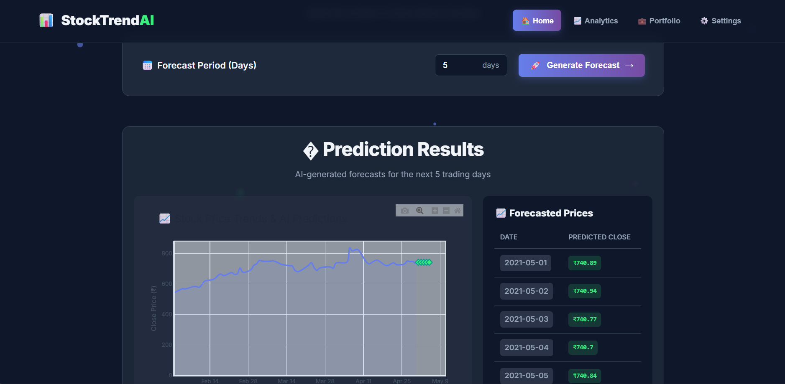

# StockTrendAI — LSTM Stock Prediction Dashboard

An interactive FastAPI web app that predicts future stock close prices using an LSTM neural network. The app serves a modern animated UI and a Plotly chart to visualize historical trends and AI predictions.

## Preview

Below are screenshots of the app in action:

- Dashboard (Home)
  
  

- Dashboard (Predictions)
  
  

- Prediction Table
  
  

## Prerequisites
- Windows with PowerShell
- Python 3.10–3.12 installed and on PATH
- Internet connection to install Python packages

## Quickstart (Windows PowerShell)
Run everything from the project root (this folder).

```powershell
# 1) Create a virtual environment
python -m venv .venv

# 2) Activate the venv
.\.venv\Scripts\Activate.ps1

# 3) Install dependencies
pip install --upgrade pip
pip install -r requirements.txt

# 4) (Optional) Train the LSTM model
# This reads data/dataset.csv and saves model/scaler into models/
python src\train_lstm.py --epochs 10 --batch_size 16 --n_steps 10

# 5) Start the FastAPI app (serves the UI)
uvicorn app.main:app --reload --host 127.0.0.1 --port 8000
```

Open the app in your browser:

- http://127.0.0.1:8000

## Notes
- Training expects a CSV at `data/dataset.csv` with columns `Date` and `Close`.
- The web app looks for `models/lstm_close_model.h5` and `models/lstm_scaler.pkl`. If they are missing, you’ll see a message to train the model first.
- If you don’t have a GPU, the default `tensorflow` package will still run on CPU. If you prefer a smaller wheel, you can use `tensorflow-cpu` instead (see `requirements.txt`).

## Troubleshooting
- TensorFlow install issues: ensure you’re on a supported Python version (3.10–3.12). If installation fails, try `pip install tensorflow-cpu`.
- Import errors when running the app: confirm your virtual environment is activated and packages are installed into that environment.
- Model/scaler not loaded: make sure you trained the model and the `models/` folder contains `lstm_close_model.h5` and `lstm_scaler.pkl`.

## Project Structure
```
app/
  main.py                # FastAPI app
  templates/index.html   # Jinja2 template
  static/style.css       # Styles
  static/images/         # Screenshots
src/
  train_lstm.py          # Model training
  utils.py               # Data helpers
models/                  # Saved model & scaler
data/dataset.csv         # Input dataset
```

---
Happy predicting! If you want me to tailor the steps to your exact Python version or to generate the model automatically, let me know.


>>>>>>> f7748f6 (feat: Implement LSTM training script and utility functions)

=======
<<<<<<< HEAD
# Stock-Prediction-infosys
=======
# StockTrendAI — LSTM Stock Prediction Dashboard

An interactive FastAPI web app that predicts future stock close prices using an LSTM neural network. The app serves a modern animated UI and a Plotly chart to visualize historical trends and AI predictions.

## Preview

Below are screenshots of the app in action:

- Dashboard (Home)
  
  

- Dashboard (Predictions)
  
  

- Prediction Table
  
  

## Prerequisites
- Windows with PowerShell
- Python 3.10–3.12 installed and on PATH
- Internet connection to install Python packages

## Quickstart (Windows PowerShell)
Run everything from the project root (this folder).

```powershell
# 1) Create a virtual environment
python -m venv .venv

# 2) Activate the venv
.\.venv\Scripts\Activate.ps1

# 3) Install dependencies
pip install --upgrade pip
pip install -r requirements.txt

# 4) (Optional) Train the LSTM model
# This reads data/dataset.csv and saves model/scaler into models/
python src\train_lstm.py --epochs 10 --batch_size 16 --n_steps 10

# 5) Start the FastAPI app (serves the UI)
uvicorn app.main:app --reload --host 127.0.0.1 --port 8000
```

Open the app in your browser:

- http://127.0.0.1:8000

## Notes
- Training expects a CSV at `data/dataset.csv` with columns `Date` and `Close`.
- The web app looks for `models/lstm_close_model.h5` and `models/lstm_scaler.pkl`. If they are missing, you’ll see a message to train the model first.
- If you don’t have a GPU, the default `tensorflow` package will still run on CPU. If you prefer a smaller wheel, you can use `tensorflow-cpu` instead (see `requirements.txt`).

## Troubleshooting
- TensorFlow install issues: ensure you’re on a supported Python version (3.10–3.12). If installation fails, try `pip install tensorflow-cpu`.
- Import errors when running the app: confirm your virtual environment is activated and packages are installed into that environment.
- Model/scaler not loaded: make sure you trained the model and the `models/` folder contains `lstm_close_model.h5` and `lstm_scaler.pkl`.

## Project Structure
```
app/
  main.py                # FastAPI app
  templates/index.html   # Jinja2 template
  static/style.css       # Styles
  static/images/         # Screenshots
src/
  train_lstm.py          # Model training
  utils.py               # Data helpers
models/                  # Saved model & scaler
data/dataset.csv         # Input dataset
```

---
Happy predicting! If you want me to tailor the steps to your exact Python version or to generate the model automatically, let me know.


>>>>>>> f7748f6 (feat: Implement LSTM training script and utility functions)

>>>>>>> 8fc5bb3e880c353485d0f0afac6e0037f8387068